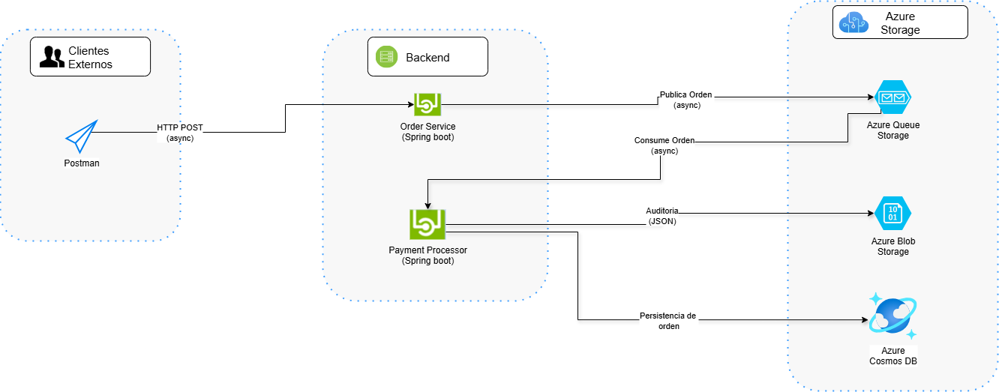

# 💳 Payment Processor

Microservicio encargado de procesar órdenes recibidas desde una Azure Queue Storage, almacenarlas en Cosmos DB y generar un archivo de auditoría en Azure Blob Storage.

---

## 📐 Arquitectura

Este microservicio forma parte de una arquitectura distribuida con enfoque en:
- Arquitectura Hexagonal (puertos y adaptadores)
- Domain-Driven Design (DDD)
- Procesamiento asíncrono basado en Azure Queue

---

## 🚀 Funcionalidad principal

- Escucha mensajes desde una **Azure Queue Storage** (`order`)
- Guarda las órdenes procesadas en **Azure Cosmos DB**
- Genera un archivo JSON con la auditoría en **Azure Blob Storage**

---

## 🧱 Tecnologías utilizadas

- Java 17
- Spring Boot
- Maven
- Azure Cosmos DB SDK
- Azure Blob Storage SDK
- Azure Queue Storage SDK
- Reactor Core (opcional)
- Lombok
- Arquitectura Hexagonal + DDD

---

## 🛠️ Diagrama de Arquitectura



---

## ▶️ Ejecución

Desde el directorio raíz del proyecto:

```bash
cd payment-processor
mvn spring-boot:run
